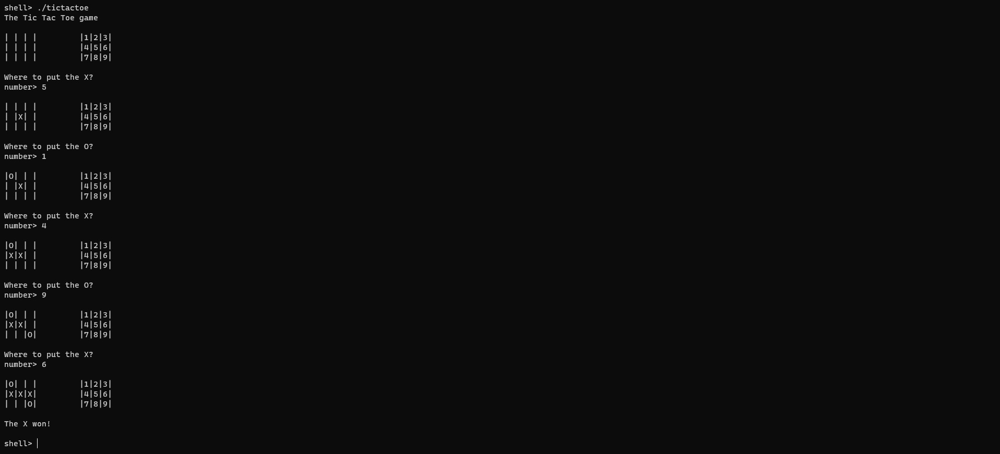

# Tic Tac Toe

This is a tic tac toe game wrote in ARM assembly for a rasperry pi 4.

# How to play?

The left grid is the game grid where the X and O will be placed. The right grid
shows the number you have to type to place your mark at a specific location.

The game starts with the X. You type the number corresponding to the position
where you want to place your mark. And then the O plays.

The game ends where there is a winner or a draw.
